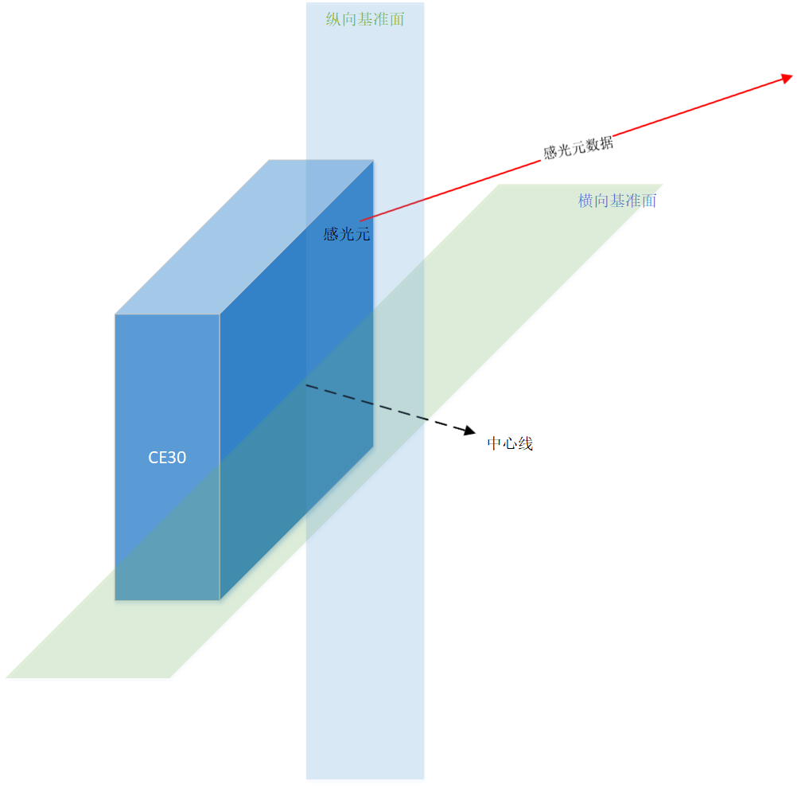

## CE30 通信协议

### 概述

本文档详述了北醒光子CE30面阵雷达的数据通信协议。该协议参考了Velodyne LIDAR® VLP-16的通信数据格式，旨在使VLP用户快速开发CE30通信接口程序。

### VLP-16数据包格式

|  Header  |    Data Block 1     |    Data Block 2     |    Data Block 3     | ...  |    Data Block 11    |    Data Block 12    | Time-stamp | Factory |
| :------: | :-----------------: | :-----------------: | :-----------------: | :--: | :-----------------: | :-----------------: | :--------: | :-----: |
| 42 Bytes |     Flag xFFEE      |     Flag xFFEE      |     Flag xFFEE      |      |     Flag xFFEE      |     Flag xFFEE      |  4 Bytes   | 2 Bytes |
|          |      Azimuth N      |    Azimuth N + 2    |    Azimuth N +4     |      |   Azimuth N + 20    |   Azimuth N + 22    |            |         |
|          |   Channel 0 Data    |   Channel 0 Data    |   Channel 0 Data    |      |   Channel 0 Data    |   Channel 0 Data    |            |         |
|          |   Channel 1 Data    |   Channel 1 Data    |   Channel 1 Data    |      |   Channel 1 Data    |   Channel 1 Data    |            |         |
|          | Channel 2 - 13 Data | Channel 2 - 13 Data | Channel 2 - 13 Data |      | Channel 2 - 13 Data | Channel 2 - 13 Data |            |         |
|          |   Channel 14 Data   |   Channel 14 Data   |   Channel 14 Data   |      |   Channel 14 Data   |   Channel 14 Data   |            |         |
|          |   Channel 15 Data   |   Channel 15 Data   |   Channel 15 Data   |      |   Channel 15 Data   |   Channel 15 Data   |            |         |
|          |   Channel 0 Data    |   Channel 0 Data    |   Channel 0 Data    |      |   Channel 0 Data    |   Channel 0 Data    |            |         |
|          |   Channel 1 Data    |   Channel 1 Data    |   Channel 1 Data    |      |   Channel 1 Data    |   Channel 1 Data    |            |         |
|          | Channel 2 - 13 Data | Channel 2 - 13 Data | Channel 2 - 13 Data |      | Channel 2 - 13 Data | Channel 2 - 13 Data |            |         |
|          |   Channel 14 Data   |   Channel 14 Data   |   Channel 14 Data   |      |   Channel 14 Data   |   Channel 14 Data   |            |         |
|          |   Channel 15 Data   |   Channel 15 Data   |   Channel 15 Data   |      |   Channel 15 Data   |   Channel 15 Data   |            |         |

（参考来源：http://www.velodynelidar.com）

### CE30 数据包格式

| 数据头  |     数据块 1     |     数据块 2     |     数据块 3     | ...  |    数据块 11     |    数据块 12     | 时间戳  | 出厂信息 |
| :--: | :-----------: | :-----------: | :-----------: | :--: | :-----------: | :-----------: | :--: | :--: |
| 42字节 |   识别码0xFFEE   |   识别码0xFFEE   |   识别码0xFFEE   |      |   识别码0xFFEE   |   识别码0xFFEE   | 4字节  | 2字节  |
|      |    横向偏射角 1    |    横向偏射角 2    |    横向偏射角 3    |      |   横向偏射角 11    |   横向偏射角 12    |      |      |
|      |   感光元 0 数据    |   感光元 0 数据    |   感光元 0 数据    |      |   感光元 0 数据    |   感光元 0 数据    |      |      |
|      |   感光元 1 数据    |   感光元 1 数据    |   感光元 1 数据    |      |   感光元 1 数据    |   感光元 1 数据    |      |      |
|      | 感光元 2 - 18 数据 | 感光元 2 - 18 数据 | 感光元 2 - 18 数据 |      | 感光元 2 - 18 数据 | 感光元 2 - 18 数据 |      |      |
|      |   感光元 19 数据   |   感光元 19 数据   |   感光元 19 数据   |      |   感光元 19 数据   |   感光元 19 数据   |      |      |

#### 数据包的组成

- 一个42字节的数据头#
- 12个64字节的数据块
- 一个4字节的时间戳
- 一个2字节的出厂信息

其中，每个数据块容纳感光阵列中由上至下一整个纵列的所有感光元信息。每个数据块包含：

- 一个2字节的识别码，其值为0xFFEE
- 一个2字节的横向偏射角
- 20个感光元信息

其中，每个感光元信息包含

- 一个2字节的距离信息 
- 一个1字节的强度信息

因此，每个数据包的大小为`42+64*12+4+2=816`个字节。

#### 偏射角的解算

每个CE30包含了320*20个感光元。每个感光元具有唯一的测量方向，该方向是基于CE30自身坐标系描述的空间姿态。为了用户使用简便，我们将该姿态向量与CE30横向基准面的夹角称之为其纵向偏射角；同时，与纵向基准面的夹角为横向偏射角。**CE30位于每个纵列上的感光元的横向偏射角相同，纵向偏射角可以通过给定公式或查表算得。** 横向偏射角、纵向偏射角及感光元测得的距离可以描述出一个CE30自身坐标系下的空间点。

横向偏射角由两个字节数据表示。如收到了0x33 0x71的横向偏射角信息，其解算步骤如下：

1. 调换两个字节数据的顺序：0x71 0x33
2. 获得两字节整型：0x7133
3. 转换成十进制：28979
4. 除以100得到角度：289.79°

#### 感光元数据的解算

感光元数据由3个字节构成，包含了距离和反射率两种信息。其中距离占2个字节，反射率占1个字节。例如，收到0x89 0x59 0x00的感光元数据，其解算方式如下：

- 解算距离：

  1. 调换前两个字节数据的顺序：0x59 0x89
  2. 获得两字节整型：0x5989
  3. 转换成十进制：22921
  4. 乘以2.0毫米：45842毫米
  5. 除以1000得到距离：45.842米

- 解算光强：

  第三个字节的值：0x00

#### 时间戳的解算

时间戳对应了第一个数据块获得的时间。由4字节构成。例如收到了0x61 0x67 0xB9 0x5A的时间戳数据，其解算方式如下：

1. 翻转四个字节数据的顺序：0x5A 0xB9 0x67 0x61
2. 获得四字节整型：0x5AB96761
3. 转换成十进制：1522100065
4. 除以1000000获得秒数：1522.100065

注：若在启动测距之前，没有向CE30-D同步时间戳，则，当CE30-D收到开始测距指令时，为时间戳零点。