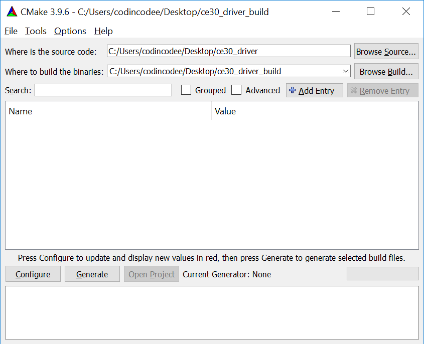
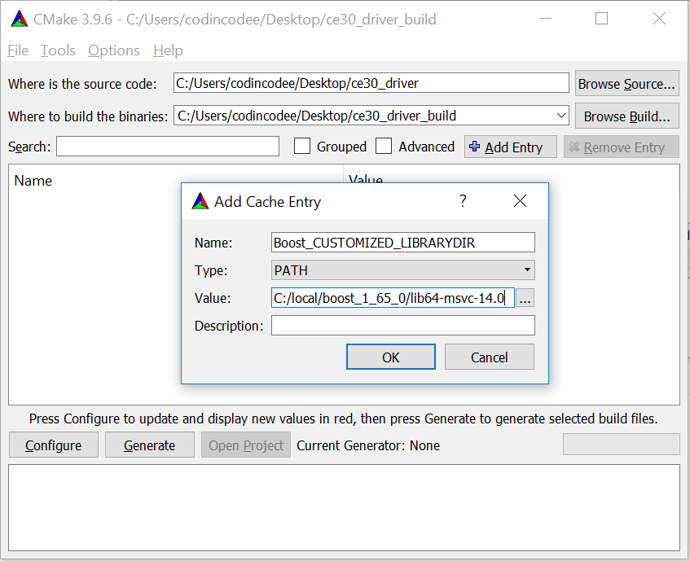
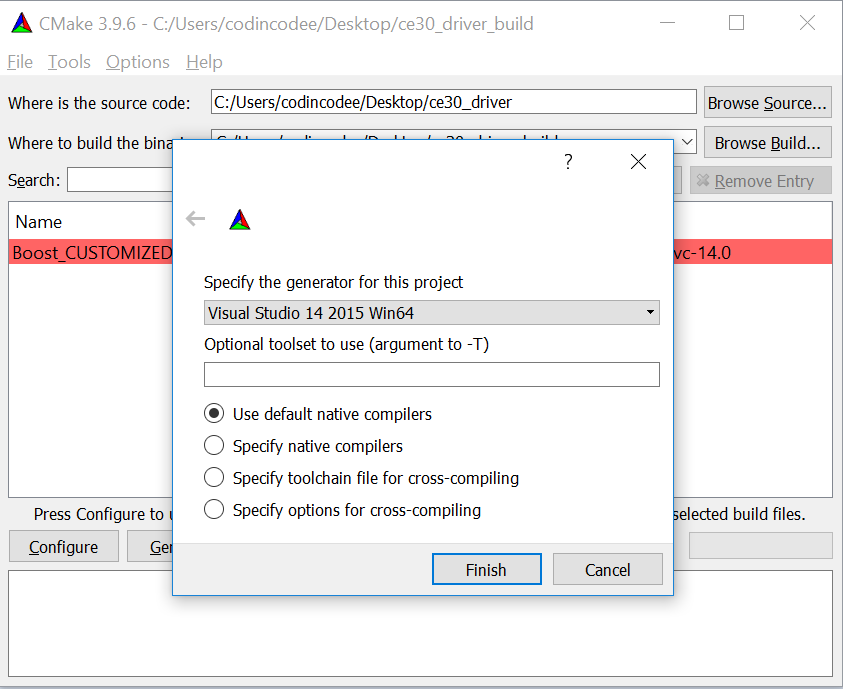
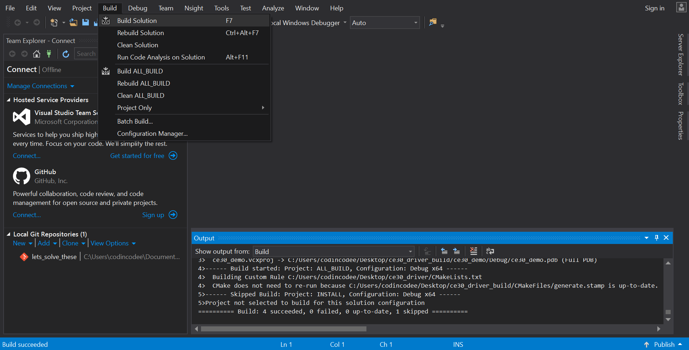

## CE30 Driver设计文档

#### 工程结构

```
-| ce30_driver
  -| ce30_driver
  -| ce30_demo
```

`ce30_driver`：CE30-D驱动库，Win10环境编译后生成ce30_driver.dll（Ubuntu环境编译后生成libce30_driver.so）。ce30_driver包含了上位机与CE30-D传感器通信与数据解析等开发接口。

`ce30_demo`：调用ce30_driver点云接口并打印点云数据值的简单示例程序。Win10环境编译后生成ce30_demo.exe。

#### 构建编译

##### Windows环境

- 推荐使用CMake 3.9.6构建工程，并使用Visual C++ 2015 64位编译器编译代码。

- 该工程依赖Boost库，推荐安装boost_1_65_0-msvc-14.0-64。

- 安装后打开CMake (cmake-gui)，输入源码根目录以及build目录路径。



- 点击`+ Add Entry`按钮，添加变量`Boost_CUSTOMIZED_LIBRARYDIR`，将其值设为Boost目录的库文件所在目录。

  

- 点击`Configure`按钮，选择编译器Visual Studio 14 2015 Win64（前提是系统中已经安装该编译器）。

  
  

- Configure成功后点击`Generate`按钮。

  

- Generate成功后点击`Open Project`按钮。

  

- 编译完成。此时build目录（本例中为"C:/Users/codincodee/Desktop/ce30_driver_build"）下应生成两个文件夹。

  ```
  -| ce30_demo
    -| Debug
      -| ce30_demo.exe
  -| ce30_driver
    -| Debug
      -| ce30_driver.dll
  ```

  为了方便开发，可将ce30_driver.dll所在目录增加至`PATH`系统路径。或者将ce30_driver.dll拷贝至ce30_demo.exe所在目录。在成功连接CE30-D设备的前提下，双击ce30_demo.exe，若在弹出的命令窗中看到点云打印数据，说明工程构建成功。若弹出命令窗后两秒退出，说明工程构建成功，但未与设备正常通信。请检查连接状态。

##### Linux环境

- 推荐使用Ubuntu 16.04系统。

- 安装CMake, Boost, GCC-C++等依赖。

  ```
  sudo apt-get update
  sudo apt-get install build-essential
  sudo apt-get install libboost-all-dev
  ```

- 编译ce30_driver

  假设ce30_driver源码根目录路径为/home/codincodee/ce30_driver

  ```
  cd /home/codincodee/ce30_driver
  mkdir build
  cd build
  cmake ..
  make
  sudo make install
  ```

- 运行ce30_demo

  ```
  ce30_demo
  ```

  执行该程序的预期结果与Window平台上的预期结果一直。

#### 代码框架

```
+---------------------------------------
| UPD通信层
|
|                +-------------+
|                | boost::asio |
|                +-------------+
|                       ^
|                    封装/调用      
|                       |
|                +----------------+
|                | TimedUPDSocket |
|                +----------------+
|                        ^
|                     封装/调用
|                     线程保护
|                        |
|                   +-----------+                 
|                   | UDPSocket |<----------------------------------------+
|                   +-----------+                                         |
|                        ^                                                |
+------------------------|--------------                                  |
| 解析层                 接口                                               |
|                        |                                                |
|                   +------------+                                        |
|                   | PacketBase |<---------------------------------------|
|                   +------------+                                        |
|                         ^                                               |
|                      继承/实现                                        封装/调用
|                         |                                               |
|      +------------------+----------+-----------------------------+      |
|      |                             |                             |      ^
| +--------+                 +---------------+                     |      |
| | Packet |              +->| RequestPacket |                     ^      |
| +--------+              |  +---------------+                     |      |
|      |               继承/实现                                    |      |
|     输出                 |  +----------------------+              |      |
|      V                  |--| VersionRequestPacket |              |      |
| +--------------+        |  +----------------------+              |      |
| | ParsedPacket |--+     |                                        |      |
| +--------------+  |     |  +-----------------------+             |      ^
|      |            |     |  | VersionResponsePacket |-------------|      |
|  数据结构包含       |     |  +-----------------------+             |      |
|      V            |     |                                        |      |
| +--------+        |     |  +--------------------+                |      |
| | Column |        |     |--| StartRequestPacket |                |      |
| +--------+        |     |  +--------------------+                |      |
|      |            |     |                                        |      |
|  数据结构包含       |     |  +-------------------+                 |      |
|      V            V     |--| StopRequestPacket |                 |      |
| +---------+       |     |  +-------------------+                 |      |
| | Channel |       |     |                                        |      |
| +---------+       |     |  +-------------------------------+     ^      |
|      |            |     |--| EnableSafetyModeRequestPacket |     |      |
|  数据结构输出       |     |  +-------------------------------+     |      |
|      V            |     |                                        |      |
| +-------+         |     |  +--------------------------------+    |      |
| | Point |         |     |--| DisableSafetyModeRequestPacket |    |      |
| +-------+         |        +--------------------------------+    |      |
|                   |                                              |      |
|                   |        +----------------------+              |      |
|                   |        | CommonResponsePacket |--------------+      ^
|                   |        +----------------------+                     |
|                   |                                                     |
+-------------------|-------------------                                  |
| 服务层             |                                                     |
|               “拼包”服务                                                 |
|     +------+      |                                                     |
|     | Scan |<-----+                                                     |
|     +------+                                                            |
|                                                                         |
|      <utils.h>                                                          |
| +-------------------+                                                   |
| | Connect           |                                                   |
| | GetVersion        |                                                   |
| | StartRunning      |                                                   |
| | StopRunning       |                                                   |
| | GetPacket         |-------------------------->------------------------+
| | SendPacket        |
| | EnableGrayOutput  |
| | DisableGrayOutput |
| +-------------------+
|          ^
|         调用
|          |
|    +-----------+
|    | UPDServer |
|    +-----------+
|
+---------------------------------------
```