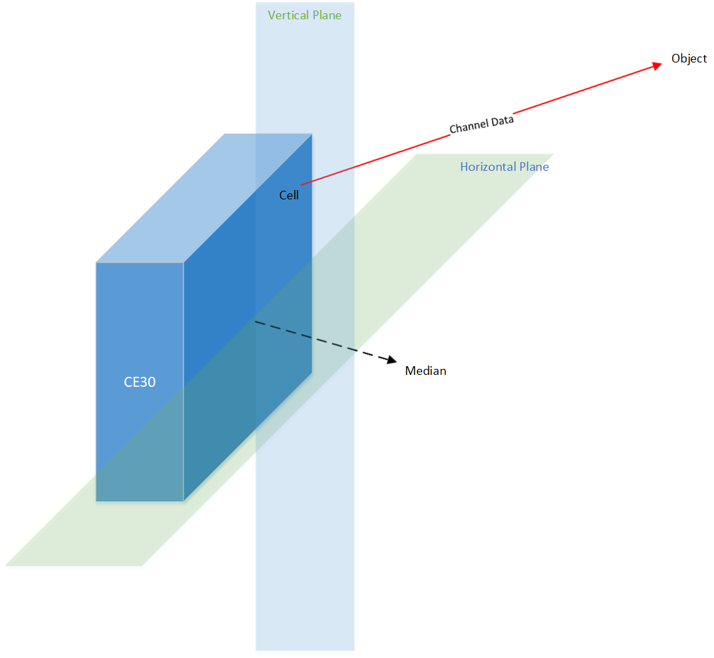

## Channel, Column and Scan



CE30-D has a 3D-ToF imager chip with 320*20 photosensitive cells. Each cell is able to ray-trace the object via distance and amplitude. Also, the ray that each cell sensed has a direction. We decompose the direction by a horizontal azimuth and a vertical azimuth. For simplicity, we call the horizontal azimuth as "azimuth", while the vertical azimuth remains its own name. Given horizontal azimuth, vertical azimuth and distance, we are able to calculate a 3D point indicating the existence of the object. We bundle the distance, amplitude and the 3D point and give a name to this collection: channel. For the collection of channels measured by cells that are in the same vertical alignment, we call a "column". According to the previous context, we know that a column contains 20 channels. The collection of 320 columns is then called a "scan". The index organization of all channels of a scan is shown in the following chart.

|   Channel [0, 0]    |   Channel [1, 0]    |   ...   |   Channel [318, 0]    |   Channel [319, 0]    |
| :-----------------: | :-----------------: | :-----: | :-------------------: | :-------------------: |
| **Channel [0, 1]**  | **Channel [1, 1]**  | **...** | **Channel [318, 1]**  | **Channel [319, 1]**  |
|       **...**       |       **...**       | **...** |        **...**        |        **...**        |
| **Channel [0, 18]** | **Channel [1, 18]** | **...** | **Channel [318, 18]** | **Channel [319, 18]** |
| **Channel [0, 19]** | **Channel [1, 19]** | **...** | **Channel [319, 19]** | **Channel [319, 19]** |

Let's look back to the previous codes.

```c++
int main() {
  ... ...
  // Now it's ready to receive measurement data
  Packet packet;
  while (true) {
    if (!GetPacket(packet, socket)) {
      continue;
    }
    unique_ptr<ParsedPacket> parsed = packet.Parse();
    if (parsed) {
      for (Column& column : parsed->columns) {
        for (Channel& channel : column.channels) {
          // Print "[distance, amplitude] (x, y, z)"
          cout << 
              "(" << channel.distance << ", " << channel.amplitude << ") "
              "[" << 
                  channel.point().x << ", " << 
                  channel.point().y << ", " << 
                  channel.point().z << "]" << endl;
        }
      }
    }
  }
  ... ...
}
```

We can see that after successfully parsed a packet, channels are acquired.

In a scan, there are 320 columns. However, we only transfer a few of them through each packet. Sometimes, we need to collect a full scan before processing all the data. `ce30_driver` provides a helper class called `scan` to deal with this. Let's do some modifications to the above snippet.

```c++
int main() {
  ... ...
  // Now it's ready to receive measurement data
  Packet packet;
  Scan scan;
  while (true) {
    if (!GetPacket(packet, socket)) {
      continue;
    }
    unique_ptr<ParsedPacket> parsed = packet.Parse();
    if (parsed) {
      scan.AddColumnsFromPacket(*parsed);
      if (!scan.Ready()) {
        continue;
      }
      for (int x = 0; x < scan.Width(); ++x) {
        for (int y = 0; y < scan.Height(); ++y) {
          Channel channel = scan.at(x, y);
          cout << 
              "(" << channel.distance << ", " << channel.amplitude << ") "
              "[" << 
                  channel.point().x << ", " << 
                  channel.point().y << ", " << 
                  channel.point().z << "]" << endl;
        }
      }
      scan.Reset();
    }
  }
  ... ...
}
```

It's easy to drop a packet into the `Scan::AddColumnsFromPacket` routine and then check whether the scan is ready. If ready, we can treat the scan as an "image" and the channel as the pixel of the image. By traversing via the indices horizontally and vertically, we are able to make use of all CE30-D measurement data of the scan.


[Previous Tutorial: Using UDP Packets](using_udp_packets.md)